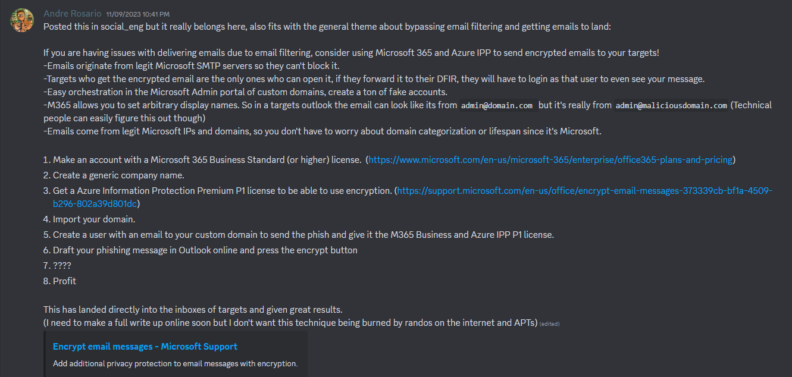

# Phishing Engagement Infrastructure Setup Guide
> **Note:** These are copy of my [personal notes](https://an0nud4y.notion.site/Phishing-Red-Team-Engagement-Infra-1c6fba8f2d854a14ba76320284161c5e?pvs=4). Please Do not completely rely on them.

## Blogs/Talks

- BHIS | How to Build a Phishing Engagement - Coding TTP's : [https://m.youtube.com/watch?si=YTjMa8XBusj_tPdc&v=VglCgoIjztE&feature=youtu.be](https://m.youtube.com/watch?si=YTjMa8XBusj_tPdc&v=VglCgoIjztE&feature=youtu.be)


## Red Team/Phishing Infra Automation

- [https://github.com/dazzyddos/HSC24RedTeamInfra/blob/main/RedTeamInfraAutomation.pdf](https://github.com/dazzyddos/HSC24RedTeamInfra/blob/main/RedTeamInfraAutomation.pdf)


## Domain Purchase and Categorization Techniques

- Check for Expired Domain and Possibly purchase the good ones
    - [https://expireddomains.net/](https://expireddomains.net/)
- Domain Categorization
    - Bluecoat/Symantec - [https://sitereview.bluecoat.com/#/](https://sitereview.bluecoat.com/#/)
    - McAfee - [https://www.trustedsource.org](https://www.trustedsource.org/)
    - Palo Alto Wildfire - [https://urlfiltering.paloaltonetworks.com](https://urlfiltering.paloaltonetworks.com/)
    - Websense - [https://csi.forcepoint.com](https://csi.forcepoint.com/) & [https://www.websense.com/content/SiteLookup.aspx](https://www.websense.com/content/SiteLookup.aspx) (needs registration)
    - FortiGuard - [https://www.fortiguard.com/webfilter](https://www.fortiguard.com/webfilter)
    - IBM X-force - [https://exchange.xforce.ibmcloud.com](https://exchange.xforce.ibmcloud.com/)
    - Cyren - [https://www.cyren.com/security-center/url-category-check-gate](https://www.cyren.com/security-center/url-category-check-gate)
    - Checkpoint - [https://www.checkpoint.com/urlcat/main.htm](https://www.checkpoint.com/urlcat/main.htm) (needs registration)
    - Trend Micro - [https://global.sitesafety.trendmicro.com/](https://global.sitesafety.trendmicro.com/)
    - Sophos - https://secure2.sophos.com/en-us/support/contact-support.aspx  (submission only; no checking) (Click Submit a Sample -> Web Address)
    - BrightCloud - http://www.brightcloud.com/tools/url-ip-lookup.php
    - LightSpeed Systems - https://archive.lightspeedsystems.com/
      
- Automating Domain Reputation Checking/Submission
    - Domainhunter: https://github.com/threatexpress/domainhunter
    - Chameleon : https://github.com/mdsecactivebreach/Chameleon

## Improve Phishing Email Writing Using Tools

- mgeeky : [https://github.com/mgeeky/Penetration-Testing-Tools/tree/master/phishing](https://github.com/mgeeky/Penetration-Testing-Tools/tree/master/phishing)
- HTML-Linter (avoid common phishing email words) : [https://github.com/mgeeky/Penetration-Testing-Tools/blob/master/phishing/phishing-HTML-linter.py](https://github.com/mgeeky/Penetration-Testing-Tools/blob/master/phishing/phishing-HTML-linter.py)
- Decode-Spam-Headers : https://github.com/mgeeky/decode-spam-headers


## Test Email Spammyness

- https://www.mail-tester.com/

## Awesome Enterprise Email Security

- https://github.com/0xAnalyst/awesome-email-security

## Delivering Emails in Inbox

- Method -1
    - Use SendGrid - http://sendgrid.com/
        - useful service but honestly, You need Pro pain plan to be lucky not to be on a spamlist
    - MailGun - https://app.mailgun.com/
        - haven't had any problem
    - [Amazon AWS SES](https://aws.amazon.com/ses/)
    - Brevo : https://www.brevo.com/free-smtp-server/
    - Outlook
    - Gmail
    - Setup a Microsoft365 Tenant
      
- Method - 2 (By Andre Rosario - From **BreakDev Red** Discord)
    - If you are having issues with delivering emails due to email filtering, consider using Microsoft 365 and Azure IPP to send encrypted emails to your targets!
        - Emails originate from legit Microsoft SMTP servers so they can't block it.
        - Targets who get the encrypted email are the only ones who can open it, if they forward it to their DFIR, they will have to login as that user to even see your message.
        - Easy orchestration in the Microsoft Admin portal of custom domains, create a ton of fake accounts.
        - M365 allows you to set arbitrary display names. So in a targets outlook the email can look like its from `admin@domain.com` but it's really from `admin@maliciousdomain.com` (Technical people can easily figure this out though)
        - Emails come from legit Microsoft IPs and domains, so you don't have to worry about domain categorization or lifespan since it's Microsoft.
    - Steps
        1. Make an account with a Microsoft 365 Business Standard (or higher) license.  ([https://www.microsoft.com/en-us/microsoft-365/enterprise/office365-plans-and-pricing](https://www.microsoft.com/en-us/microsoft-365/enterprise/office365-plans-and-pricing))
        2. Create a generic company name.
        3. Get a Azure Information Protection Premium P1 license to be able to use encryption. ([https://support.microsoft.com/en-us/office/encrypt-email-messages-373339cb-bf1a-4509-b296-802a39d801dc](https://support.microsoft.com/en-us/office/encrypt-email-messages-373339cb-bf1a-4509-b296-802a39d801dc))
        4. Import your domain.
        5. Create a user with an email to your custom domain to send the phish and give it the M365 Business and Azure IPP P1 license.
        6. Draft your phishing message in Outlook online and press the encrypt button
        7. ????
        8. Profit
    - Screenshot
        
        
        


## Phishing Engagements With Evilginx

- **Building Evilginx Phishlets**
    - Evilginx Mastery Course : [https://academy.breakdev.org/evilginx-mastery](https://academy.breakdev.org/evilginx-mastery)
    - Evilginx Docs : [https://help.evilginx.com/](https://help.evilginx.com/)
    - Evilginx Phishlets Collections : [https://github.com/An0nUD4Y/Evilginx2-Phishlets](https://github.com/An0nUD4Y/Evilginx2-Phishlets)
    - Evilginx Less Known Techniques : [https://github.com/An0nUD4Y/Evilginx2-Phishlets?tab=readme-ov-file#some-less-known-techniques](https://github.com/An0nUD4Y/Evilginx2-Phishlets?tab=readme-ov-file#some-less-known-techniques)

- **Evilginx Installation Scripts**
    - [https://gist.github.com/dunderhay/d5fcded54cc88a1b7e12599839b6badb](https://gist.github.com/dunderhay/d5fcded54cc88a1b7e12599839b6badb)

- **Securing Evilginx Infra tips -**
    - [https://github.com/An0nUD4Y/Evilginx2-Phishlets#securing-evilginx-infra-tips](https://github.com/An0nUD4Y/Evilginx2-Phishlets#securing-evilginx-infra-tips)
        
        ```markdown
        - Rewrite URLs on Phishing Pages to avoid detection through URL Path pattern matching (by Kuba).
        - Remove IOCs (X-Evilginx header and Default Cert Details)
        - Modify Unauth redirect static contents
        - Modify code to request wildcard certificates for root domain from Let'sEncrypt other than requesting for each subdomains (As mentioned in Kuba's blog) - Check this repo for reference https://github.com/ss23/evilginx2
        - Put evilginx behind a proxy to help against TLS fingerprinting (JA3 and JA3S)
        - Use cloudflare in between if possible/feasible (You have to configure the SSL Settings correctly, change it to Full in cloudflare settings)
        - Use some known ASN blacklist to avoid getting detected like here (https://github.com/aalex954/evilginx2-TTPs#ip-blacklist)
        - Reduce the Number of proxyhosts in phishlet if possible to reduce content loading time.
        - Host Evilginx at Azure and use their domain (limit proxy host in phishlet to 1 or find a way , may be create multiple azure sub domains and try with that)
        - Add some sub_filters to modify the content of the pages to avoid content based detections, like (Favicon, form title font or style, or anything which seems relevant)
        - Block the feedback/telemetry/logs/analytics subdomains using the phishlet sub_filters which can log the domain or may help later on analysis.
        - See if js-injected is static or dynamic , if static modify the evilginx js-inject code to create dynamic/obfuscated version of your js for each user/target.
        - Make sure to not leak your Evilginx infra IP, Check the DNS history to make sure its not stored anywhere (Analysts may look for older DNS Records of the domain)
        - Be aware of this research : https://catching-transparent-phish.github.io/catching_transparent_phish.pdf , repo - https://catching-transparent-phish.github.io/
        ```
        
    - Remove X-Evilginx header (Check all the code lines with `req.Header.Set` and comment relevant functions)
    - Search for `<html>` in core/http_proxy.go file and modify the html code to remove any static signatures.
    - Also to avoid the static injected js code signature detection , You can modify the code as below
        - Make sure to add "[github.com/tdewolff/minify/js](http://github.com/tdewolff/minify/js)" in imports
            
            ```jsx
            	re := regexp.MustCompile(`(?i)(<\s*/body\s*>)`)
            	var d_inject string
            
            	if script != "" {
            		minifier := minify.New() // "github.com/tdewolff/minify/js"
            		minifier.AddFunc("text/javascript", js.Minify)
            		obfuscatedScript, err := minifier.String("text/javascript", script)
            		if err != nil {
            			// Handle error - Obfuscation failed
            			d_inject = "<script" + js_nonce + ">" + "function doNothing() {var x =0};" + script + "</script>\n${1}"
            		}
            		d_inject = "<script" + js_nonce + ">" + "function doNothing() {var x =0};" + obfuscatedScript + "</script>\n${1}"
            		//d_inject = "<script" + js_nonce + ">" + "function doNothing() {var x =0};" + script + "</script>\n${1}"
            
            	} else if src_url != "" {
            		d_inject = "<script" + js_nonce + " type=\"application/javascript\" src=\"" + src_url + "\"></script>\n${1}"
            	} else {
            		return body
            	} 
            ```
            
    - Modify core/cert.db file as well
    - Change `“rid”` for gophish.
    - Rewrite URLs on Phishing Pages to avoid detection through URL Path pattern matching (by Kuba). [This Feature not available in evilginx Public Version, You have to implement it yourself.]
        
        ```markdown
        # Only Work in Evilginx Pro Version
        # Similar functionality can be implemented in public version as well.
        rewrite_urls:
        
        trigger:
        domains: ['www.linkedin.com']
        paths: ['^/login$']
        rewrite:
        path: '/this/is/not/the/path/you/are/looking/for.php'
        query:
        
            {key:'a', value: 'HOW'}
            {key:'b', value: 'MUCH'}
            {key:'d', value: 'IS'}
            {key:'e', value: 'THE'}
            {key:'f', value: 'PHISH'}
            {key:'q', value: '{id}'}
        
        ```
        
        

    - Modify the lure/session identifier cookies signatured pattern and value (by @[rad9800](https://x.com/rad9800/status/1858242066356019317?s=46&t=mlJvZy0Zrkrxzuvtt7m2cQ) )
        - Rule 1: Cookie name=XXXX-XXXX & value=64_hex_chars - https://gist.github.com/rad9800/bb73de360fc07ac544f0bc9faac9082d#file-index-js-L130
            - Responsible evilginx Code Functionality (For cookie-Name) : https://github.com/kgretzky/evilginx2/blob/9e32484719681892945130187ea52737b3d72051/core/http_proxy.go#L1984
            - Responsible evilginx Code Functionality (For cookie-Value) : https://github.com/kgretzky/evilginx2/blob/9e32484719681892945130187ea52737b3d72051/core/http_proxy.go#L895
        - Rule 2: Script path=/s/64_hex_chars.js with content-length=0
        - Rule 3: Both Rule 1 & Rule 2 present
            - the full snippet js blob logic is here https://gist.github.com/rad9800/bb73de360fc07ac544f0bc9faac9082d
    - Block Referrer headers from leaking your phishing domain name - check [this](https://insights.spotit.be/2024/06/03/clipping-the-canarys-wings-bypassing-aitm-phishing-detections/) research blog for reference :
        - Add below line in http_proxy.go file [here](https://github.com/kgretzky/evilginx2/blob/55579600ca826a94b328d5e0cb35740045a35b2e/core/http_proxy.go#L887) (Chrome don’t respect this and when request is initiated by url() CSS function - check blog for more)
            - `resp.Header.Set("Referrer-Policy", "no-referrer")`
            - To automate from phishlet Check this PR : https://github.com/kgretzky/evilginx2/pull/1006
    - Define your own CSP (Content security Policy) to avoid telemetry/canary/detection by leaking phishing domain.
        - Read this for more : https://insights.spotit.be/2024/06/03/clipping-the-canarys-wings-bypassing-aitm-phishing-detections/
    - Check if target site is using some sort of canary tokens (CSS, JS) and avoid them
        - Bypassing (CSS,JS) Canary AiTM Detection : https://insights.spotit.be/2024/06/03/clipping-the-canarys-wings-bypassing-aitm-phishing-detections/
        - https://blog.thinkst.com/2024/01/defending-against-the-attack-of-the-cloned-websites.html
    - JA4 fingerprint evasion
        - https://github.com/refraction-networking/utls
        - https://github.com/juzeon/spoofed-round-tripper


### Evilginx Research Blogs/Talks :
- A smooth sea never made a skilled phisherman - Kuba Gretzky (x33fc0n 2024) :
    - Talk : [https://youtu.be/Nh99d3YnpI4?si=Ltwus2PS0z97gf2R](https://youtu.be/Nh99d3YnpI4?si=Ltwus2PS0z97gf2R)
    - Slides : [https://github.com/kgretzky/talks/blob/main/2024/x33fcon/a-smooth-sea-never-made-a-skilled-phisherman.pdf](https://github.com/kgretzky/talks/blob/main/2024/x33fcon/a-smooth-sea-never-made-a-skilled-phisherman.pdf)
- The triforce of initial Access : [https://trustedsec.com/blog/the-triforce-of-initial-access](https://trustedsec.com/blog/the-triforce-of-initial-access)
    - Bobber : [https://github.com/Flangvik/Bobber](https://github.com/Flangvik/Bobber)
- Bypassing Canary AiTM Detection : [https://insights.spotit.be/2024/06/03/clipping-the-canarys-wings-bypassing-aitm-phishing-detections/](https://insights.spotit.be/2024/06/03/clipping-the-canarys-wings-bypassing-aitm-phishing-detections/)
- Protect Evilginx using cloudflare and HTML obf : [https://www.jackphilipbutton.com/post/how-to-protect-evilginx-using-cloudflare-and-html-obfuscation](https://www.jackphilipbutton.com/post/how-to-protect-evilginx-using-cloudflare-and-html-obfuscation)
- (Improve Evilginx email delivery trust) Adding SPF, DMARC, DKIM, MX records : [https://fortbridge.co.uk/research/add-spf-dmarc-dkim-mx-records-evilginx/](https://fortbridge.co.uk/research/add-spf-dmarc-dkim-mx-records-evilginx/)
    - [https://m3rcer.netlify.app/redteaming/spamfilterbypass/](https://m3rcer.netlify.app/redteaming/spamfilterbypass/)
- Phishing Tactics and OPSEC : [https://mgeeky.tech/uploads/WarCon22 - Modern Initial Access and Evasion Tactics.pdf](https://mgeeky.tech/uploads/WarCon22%20-%20Modern%20Initial%20Access%20and%20Evasion%20Tactics.pdf)
- Evilginx + BITB + Evasion Tactics : [https://youtu.be/p1opa2wnRvg](https://youtu.be/p1opa2wnRvg)
- Hook, Line and Phishlet - Conquering AD FS With Evilginx : [https://research.aurainfosec.io/pentest/hook-line-and-phishlet/](https://research.aurainfosec.io/pentest/hook-line-and-phishlet/)
- O365 Phishing Infrastructure - [https://badoption.eu/blog/2023/12/03/PhishingInfra.html](https://badoption.eu/blog/2023/12/03/PhishingInfra.html)
- You Can’t See Me – Protecting Your Phishing Infrastructure : [https://redsiege.com/blog/2024/01/you-cant-see-me-protecting-your-phishing-infrastructure/](https://redsiege.com/blog/2024/01/you-cant-see-me-protecting-your-phishing-infrastructure/)
- [https://janbakker.tech/evilginx-resources-for-microsoft-365/](https://janbakker.tech/evilginx-resources-for-microsoft-365/)
- Evilginx + BITB - [https://www.youtube.com/watch?v=luJjxpEwVHI&feature=youtu.be](https://www.youtube.com/watch?v=luJjxpEwVHI&feature=youtu.be)
- Hook, Line and Sinker: Phishing Windows Hello for Business using Evilginx : [https://medium.com/@yudasm/bypassing-windows-hello-for-business-for-phishing-181f2271dc02](https://medium.com/@yudasm/bypassing-windows-hello-for-business-for-phishing-181f2271dc02)
- Phishing the resistant - Phishing for primary Refresh token in Microsoft Entra by Dirk Jan  : [https://youtu.be/tNh_sYkmurI?si=qcb917IB5zHU1fQk](https://youtu.be/tNh_sYkmurI?si=qcb917IB5zHU1fQk)
- X33fcon 2024 - [https://youtu.be/Nh99d3YnpI4?si=Ltwus2PS0z97gf2R](https://youtu.be/Nh99d3YnpI4?si=Ltwus2PS0z97gf2R)
- Like Shooting Phish in a Barrel - Bypassing Link Crawlers : ****https://posts.specterops.io/like-shooting-phish-in-a-barrel-926c1905bb4b
- Drink Like a Phish - How to Make Your Phishing Sites Blend In ****: [https://posts.specterops.io/drink-like-a-phish-b9e91d0b5677](https://posts.specterops.io/drink-like-a-phish-b9e91d0b5677?source=collection_home---6------0-----------------------)
- Feeding the Phishes : ****https://posts.specterops.io/feeding-the-phishes-276c3579bba7
- https://posts.specterops.io/phish-out-of-water-aaeb677a5af3
- https://youtu.be/6jYZQKDlKco?si=cpfd4tWQ4V8ZAZaI
- https://posts.specterops.io/one-phish-two-phish-red-teams-spew-phish-1a2f02010ed7
- Push Security Phishing Tools Detection : https://gist.github.com/rad9800/bb73de360fc07ac544f0bc9faac9082d
    - Push Security's chrome extension detect evilginx with some pretty brittle rules
        - Rule 1: Cookie name=XXXX-XXXX & value=64_hex_chars
        - Rule 2: Script path=/s/64_hex_chars.js with content-length=0
        - Rule 3: Both Rule 1 & Rule 2 present
        - the full snippet js blob logic is here https://gist.github.com/rad9800/bb73de360fc07ac544f0bc9faac9082d

          
### Defense Tactics Against Evilginx
- Unravelling and Countering Adversary in the middle Phishing - X33fcon 2024 - [https://youtu.be/-W-LxcbUxI4](https://youtu.be/-W-LxcbUxI4?feature=shared)
- Using HoneyTokens to detect AiTM : [https://zolder.io/using-honeytokens-to-detect-aitm-phishing-attacks-on-your-microsoft-365-tenant/](https://zolder.io/using-honeytokens-to-detect-aitm-phishing-attacks-on-your-microsoft-365-tenant/)
- Protect Against Modern Phishing : [https://bleekseeks.com/blog/how-to-protect-against-modern-phishing-attacks](https://bleekseeks.com/blog/how-to-protect-against-modern-phishing-attacks)
- [https://www.youtube.com/watch?v=wTLB0Yh70_0](https://www.youtube.com/watch?v=wTLB0Yh70_0)
- Detecting evilginx using JA3, JA3S, JA4 fingerprinting
    - JA4 Database : [https://ja4db.com/](https://ja4db.com/)
    

    


## Securing GoPhish Infra

> These modifications will also work in the latest evilginx + gophish version i.e evilginx3.3
> 
- Tips : Use {{.URL}} parameter in phishing template while using with evilginx ( [https://github.com/kgretzky/evilginx2/issues/1042#issuecomment-2052073864](https://github.com/kgretzky/evilginx2/issues/1042#issuecomment-2052073864))
- Modifications in gophish source code and file structure to Secure the GoPhish Infra
    - Remove `X-Gophish` instances ( `X-Gophish-Contact` , `X-Gophish-Signature`)
    - Remove `const ServerName= "gophish"` and change it to `const ServerName= "IGNORE"` in file `config/config.go`
    - Change the default Admin server port in `config.json` file.
    - Modify Test Email Message Signatures, To avoid detection during SMTP Testing. `Controllers > api > util.go`
        
        ```yaml
        Controllers > api > util.go
        models > testdata > email_request.go
        models > testdata > email_request_test.go
        models > testdata > maillog.go
        models > testdata > maillog_test.go
        models > testdata > smtp_test.go
        ```
        
    - Change 404 response
        - Add below custom function in `controllers/phish.go` file
            
            ```go
            func customNotFound(w http.ResponseWriter, r *http.Request) {
            	http.Error(w, "Try again!", http.StatusNotFound)
            }
            ```
            
        - Now replace all instances of `http.NotFound(w, r)` to `customNotFound(w, r)`
    - Remove robots.txt hardcoded response and modify it in file `controllers/phish.go`
        - Modify the respective code in phish.go file to below one.
            
            ```go
            //Modified Response
            // RobotsHandler prevents search engines, etc. from indexing phishing materials
            func (ps *PhishingServer) RobotsHandler(w http.ResponseWriter, r *http.Request) {
            	fmt.Fprintln(w, "User-agent: *\nDisallow: /*/*\nDisallow: /.git/*")
            }
            ```
            
    - Modify the `“rid”` GET Parameter in requests
        - Make sure to modify all the instances of `"rid"` to something else.
        - These are also present in evilginx3.3 source code , So make sure to modify there as well.
    - For advance preventions, You can modify the static folder as well and rename it to something else, also rename the files inside it to avoid path based detection. Just do not forget to modify the relevance source code as well.
        - Like images name , example : pixel.png , modify it to something else.
    - Change the Certificate Properties in `util/util.go` file
        
        ```go
        	template := x509.Certificate{
        		SerialNumber: serialNumber,
        		Subject: pkix.Name{
        			//Organization: []string{"Gophish"},
        			Organization: []string{"Microsoft Corporation"},
        		},
        ```
        
    - Use Nginx to proxy traffic through it to avoid any Golang Server Fingerprint
        - `service nginx start`
        - You need to change the gophish `config.json` to change the ports for http from 80 to 8080 and https from default to 60002, as shown below
            
            ```yaml
            {
            	"admin_server": {
            		"listen_url": "127.0.0.1:60002",
            		"use_tls": true,
            		"cert_path": "gophish_admin.crt",
            		"key_path": "gophish_admin.key",
            		"trusted_origins": []
            	},
            	"phish_server": {
            		"listen_url": "127.0.0.1:8080",
            		"use_tls": false,
            		"cert_path": "example.crt",
            		"key_path": "example.key"
            	},
            	"db_name": "sqlite3",
            	"db_path": "gophish.db",
            	"migrations_prefix": "db/db_",
            	"contact_address": "",
            	"logging": {
            		"filename": "",
            		"level": ""
            	}
            }
            ```
            
        - Below configuration will block all requests with user agent containing “Bot” or “bot”
            
            ```yaml
            # /etc/nginx/nginx.conf
            
            events {
                # Define event processing parameters here
                worker_connections 1024; # Adjust according to your requirements
            }
            
            http {
            
                upstream backend {
                    server localhost:8080;
                }
                # HTTP server
                server {
                    listen 80 default_server;
                    
            
                    # Reject requests with "bot" or "Bot" in User-Agent
                    if ($http_user_agent ~* (bot|Bot)) {
                        return 403;
                    }
            
                    location / {
                        proxy_pass http://backend;
                        proxy_set_header Host $host;
                        proxy_set_header X-Real-IP $remote_addr;
                        proxy_set_header X-Forwarded-For $proxy_add_x_forwarded_for;
                        proxy_set_header X-Forwarded-Proto $scheme;
                    }
                }
            
                upstream backend_https {
                    server localhost:60002;
                }
                # HTTPS server
                server {
                    listen 60001 ssl default_server;
            
                    ssl_certificate /root/Phishing/gophish-mod/gophish_admin.crt;
                    ssl_certificate_key /root/Phishing/gophish-mod/gophish_admin.key;
            
                    # Reject requests with "bot" or "Bot" in User-Agent
                    if ($http_user_agent ~* (bot|Bot)) {
                        return 403;
                    }
            
                    location / {
                        proxy_pass https://backend_https;
                        proxy_set_header Host $host;
                        proxy_set_header X-Real-IP $remote_addr;
                        proxy_set_header X-Forwarded-For $proxy_add_x_forwarded_for;
                        proxy_set_header X-Forwarded-Proto $scheme;
                    }
                }
            }
            
            ```
            
        - To allow specific user agent only, use below config. This will block all requests and only allow requests which has user agent “`iamdevil`”.
            
            ```yaml
            # /etc/nginx/nginx.conf
            
            events {
                # Define event processing parameters here
                worker_connections 1024; # Adjust according to your requirements
            }
            
            http {
            
                upstream backend {
                    server localhost:8080;
                }
            
                # HTTP server
                server {
                    listen 80 default_server;
            
                    # Reject requests with user agent other than "iamdevil"
                    if ($http_user_agent != "iamdevil") {
                        return 403;
                    }
            
                    location / {
                        proxy_pass http://backend;
                        proxy_set_header Host $host;
                        proxy_set_header X-Real-IP $remote_addr;
                        proxy_set_header X-Forwarded-For $proxy_add_x_forwarded_for;
                        proxy_set_header X-Forwarded-Proto $scheme;
                    }
                }
            
                upstream backend_https {
                    server localhost:60002;
                }
            
                # HTTPS server
                server {
                    listen 60001 ssl default_server;
            
                    ssl_certificate /root/Phishing/gophish-mod/gophish_admin.crt;
                    ssl_certificate_key /root/Phishing/gophish-mod/gophish_admin.key;
            
                    # Reject requests with user agent other than "iamdevil"
                    if ($http_user_agent != "iamdevil") {
                        return 403;
                    }
            
                    location / {
                        proxy_pass https://backend_https;
                        proxy_set_header Host $host;
                        proxy_set_header X-Real-IP $remote_addr;
                        proxy_set_header X-Forwarded-For $proxy_add_x_forwarded_for;
                        proxy_set_header X-Forwarded-Proto $scheme;
                    }
                }
            }
            ```
            
    - Modify Gophish Tracking Pixel signature to avoid detection based on signatured tracking pixel.
    - Change the gophish email headers sequence pattern. It may be used to detect the gophish (From BreakDev Red Community).

- [https://edermi.github.io/post/2021/modding_gophish/](https://edermi.github.io/post/2021/modding_gophish/)
- [https://www.sprocketsecurity.com/resources/never-had-a-bad-day-phishing-how-to-set-up-gophish-to-evade-security-controls](https://www.sprocketsecurity.com/resources/never-had-a-bad-day-phishing-how-to-set-up-gophish-to-evade-security-controls)
- [https://cyberwarfare.live/wp-content/uploads/2023/08/OPSEC-on-the-High-Seas_-A-Gophish-Adventure.pdf](https://cyberwarfare.live/wp-content/uploads/2023/08/OPSEC-on-the-High-Seas_-A-Gophish-Adventure.pdf)
- [https://www.sprocketsecurity.com/resources/never-had-a-bad-day-phishing-how-to-set-up-gophish-to-evade-security-controls](https://www.sprocketsecurity.com/resources/never-had-a-bad-day-phishing-how-to-set-up-gophish-to-evade-security-controls)
- [https://github.com/puzzlepeaches/sneaky_gophish](https://github.com/puzzlepeaches/sneaky_gophish)
- [https://cybercx.co.nz/blog/identifying-gophish-servers/](https://cybercx.co.nz/blog/identifying-gophish-servers/)
- [https://github.com/gophish/gophish/issues/1553#issuecomment-523969887](https://github.com/gophish/gophish/issues/1553#issuecomment-523969887)


## AiTM Post Exploitation / Phishing Research Blogs/Talks

- AiTm (Post Exploitation) : https://www.youtube.com/live/WY4mH-8TbWY?si=LkZ1LuduDln1vRuj
    - https://youtu.be/py68OE4tQ4Q?si=n6QlNuro88c1PRzn
- https://trustedsec.com/blog/the-triforce-of-initial-access

## Other Techniques

- For Abusing legit sites for Phishing : [https://lots-project.com/](https://lots-project.com/)
- BITB : [https://mrd0x.com/browser-in-the-browser-phishing-attack/](https://mrd0x.com/browser-in-the-browser-phishing-attack/)
- Progressive Web Apps (PWA) Phishing : [https://mrd0x.com/progressive-web-apps-pwa-phishing/](https://mrd0x.com/progressive-web-apps-pwa-phishing/)
- noVNC Phishing : [https://adepts.of0x.cc/novnc-phishing/](https://adepts.of0x.cc/novnc-phishing/)
- noVNC and Docker : [https://powerseb.github.io/posts/Another-phishing-tool/](https://powerseb.github.io/posts/Another-phishing-tool/)
- EvilQR - QR Phishing
    - Generate QR : [https://github.com/Flangvik/QRucible](https://github.com/Flangvik/QRucible)
    - [https://github.com/kgretzky/evilqr](https://github.com/kgretzky/evilqr) , [https://breakdev.org/evilqr-phishing/](https://breakdev.org/evilqr-phishing/)
    - [https://github.com/swagkarna/EvilJack](https://github.com/swagkarna/EvilJack)
    - [https://techcommunity.microsoft.com/t5/microsoft-security-experts-blog/hunting-for-qr-code-aitm-phishing-and-user-compromise/bc-p/4054850](https://techcommunity.microsoft.com/t5/microsoft-security-experts-blog/hunting-for-qr-code-aitm-phishing-and-user-compromise/bc-p/4054850)
- NoPhish : [https://github.com/powerseb/NoPhish](https://github.com/powerseb/NoPhish) and [https://badoption.eu/blog/2023/07/12/entra_phish.html](https://badoption.eu/blog/2023/07/12/entra_phish.html)
- EvilGoPhish : [https://github.com/fin3ss3g0d/evilgophish](https://github.com/fin3ss3g0d/evilgophish)
- Smishing : [https://blog.shared-video.mov/systematic-destruction-hacking-the-scammers-pt.-2](https://blog.shared-video.mov/systematic-destruction-hacking-the-scammers-pt.-2)
- Phishing With CloudFlare Workers
    - TryCloudflare : [https://developers.cloudflare.com/cloudflare-one/connections/connect-networks/do-more-with-tunnels/trycloudflare/](https://developers.cloudflare.com/cloudflare-one/connections/connect-networks/do-more-with-tunnels/trycloudflare/)
    - [https://github.com/zolderio/AITMWorker](https://github.com/zolderio/AITMWorker)
    - [https://gist.github.com/RedTeamOperations/33f245a777c9b322b0466b59d6687f15](https://gist.github.com/RedTeamOperations/33f245a777c9b322b0466b59d6687f15)
    - [https://cyberwarfare.live/wp-content/uploads/2023/08/Certified-Red-Team-CredOps-Infiltrator-CRT-COI-1.pdf](https://cyberwarfare.live/wp-content/uploads/2023/08/Certified-Red-Team-CredOps-Infiltrator-CRT-COI-1.pdf)
- Google Open Redirection for phishing
    - [https://untrustednetwork.net/en/2024/02/26/google-open-redirect/](https://untrustednetwork.net/en/2024/02/26/google-open-redirect/)
    - Open Redirect at : [https://googleweblight.com/i?u=m4lici0u5.com](https://googleweblight.com/i?u=m4lici0u5.com)
    - More Can be found at : [https://lots-project.com/](https://lots-project.com/)
- Phishing Past Mail Protection Controls using Azure Information Protection
    - https://youtu.be/tHNi5BzScVo?si=H2czog19AmTp_O26
    - https://youtu.be/EYUp_MNtJIk?si=sg_9RQggDvqOSLNL
    - https://youtu.be/KhdzIPPW4W0?si=E4CmWx0iO8EaR6JF
- https://nicolasuter.medium.com/aitm-phishing-with-azure-functions-a1530b52df05
- https://pushsecurity.com/blog/a-new-class-of-phishing-verification-phishing-and-cross-idp-impersonation/
